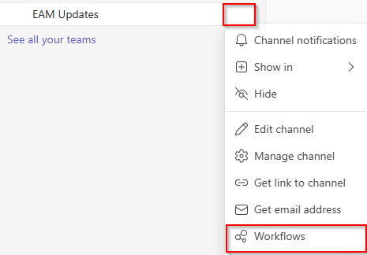
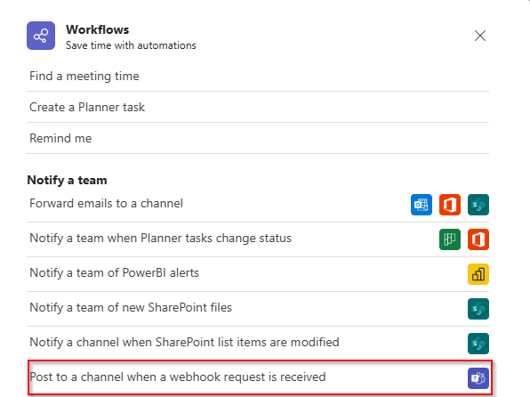
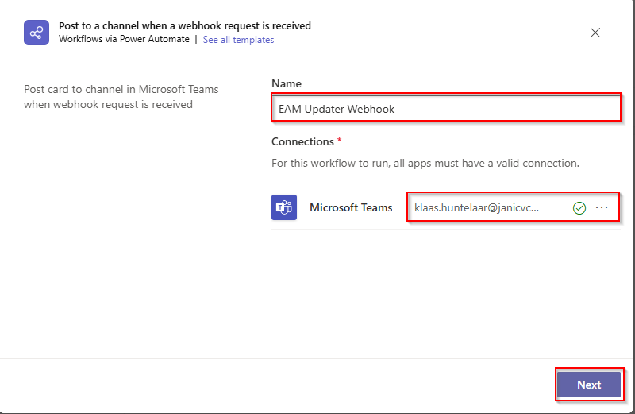
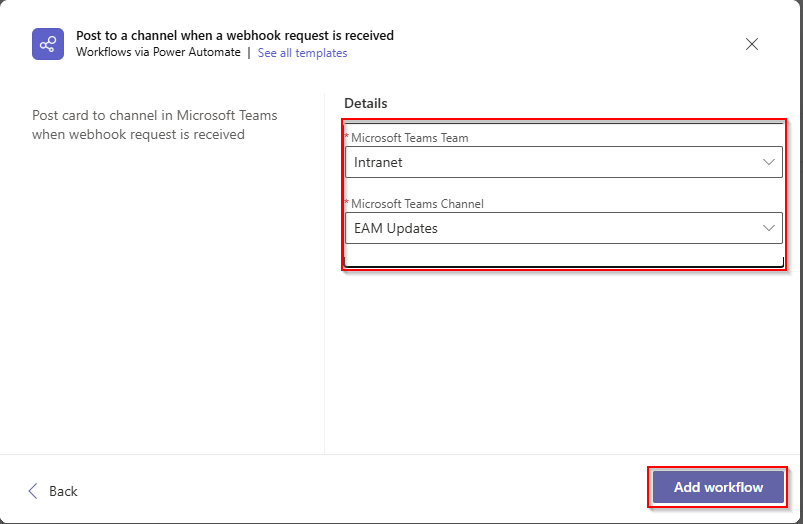

# Setup Teamswebhook

This page describes the process of setting up the Teams Webhook to receive Notifications about new applications released by the EAM-Publisher. 

## Prerequisites

The following prerequisites apply: 
* You must use an account with a teams license
* The account must be a member of the Teams Channel
* The channel must not be a private channel.
* The name of the account who setup the Webhook / Workflow will appear at the bottom of the card. This can't be omited and is by design by Microsoft. 

> I recomend that you create a seperate channel for all the notifications published by the EAM Publisher. 

## Setup

* Open Microsoft Teams and navigate to the Channel which you want to add the Webhook to. 
* Click on the three *...* next to the channel name and select *Workflows*

* Select the *Post to a channel when a webhook request is received*  workflow template. 

* Give the Webhook a name
* Authenticate using your account
* Click on *Next*

* Confirm once again the Teams Team and the Channel
* Hit *Add workflow*

* Copy and save the shown workflow URL, you will need it later. 

