# Setup Azure Automation Account

This page describes the process of:
* Setting up the Azure Automation Account which will run the EAM-Publisher runbook.
* Assigning the required permissions to the managed identity. 

## Prerequisites
To perform the steps listed on this page you need the following permissions: 
* Contributor permissions on the Ressource Group to create the Automation account
* Application Administrator permissions to add the Managed Identity permissions. 

## Setup the Automation Account

* In the [Azure Portal](https://portal.azure.com) search for Automation Accounts
* Select the Service

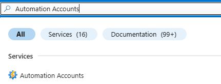

* Click on *Create*

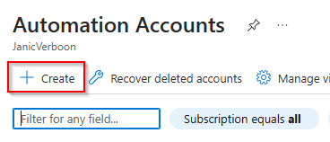

* Select the 
    * Subscription & Ressource Group you want to create the Automation Account in. 
* Configure the Automation Account name
* Select the Azure Region

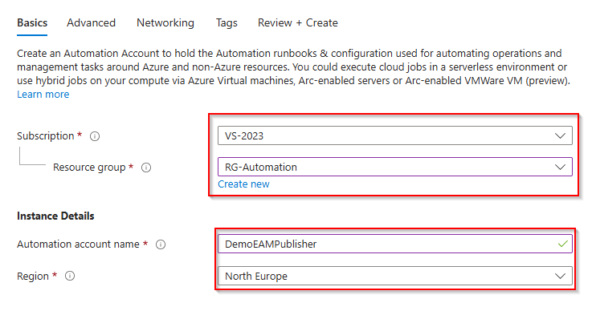

* Ensure that the *System Assigned* Managed Identity gets created. 

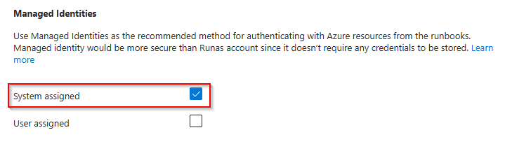

* Configure the Networking and Tags tab, based on your organizations requirements. 
* *Review & Create* the Automation Account.  

* Once the Account has been created: 
    * Expand the *Acount Settings* section
    * Select *Identity*
    * Copy the Object (Prinicpal Id)

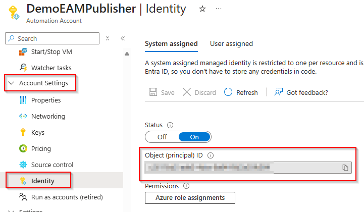

## Grant permissions to the Managed Identity

Now we need to grant the required permissions to the Managed Identity. 

| Graph Permission | Description |
| ------------ | -------------|
| "DeviceManagementManagedDevices.Read.All" | Required to read the Win32CatalogAppsUpdate Report |
| "DeviceManagementApps.ReadWrite.All" | Required to read all Managed Apps / Create, Update and Delete Apps. |
| "Group.Read.All" | Required to read basic group informations related to the assignments |
| "DeviceManagementConfiguration.Read.All" | Required to read Filter information related to the assignments"
| "DeviceManagementConfiguration.ReadWrite.All" | Required in case you want to update the device ESP with the newly released apps |

| Permission | Purpose |
|---|---|
| `DeviceManagementManagedDevices.Read.All` | Required to read the Win32CatalogAppsUpdate Report |
| `DeviceManagementConfiguration.Read.All` | Required to read Filter information related to the assignments" |
| `DeviceManagementApps.ReadWrite.All` | Read and write mobile apps, assignments, relationships, categories, and the EAM update report |
| `Group.Read.All` | Read Entra ID group properties for assignment migration |
| `DeviceManagementServiceConfig.ReadWrite.All` | Read and write Enrollment Status Page configurations and assignment filters > **Note:** Some Graph API calls target the **beta** endpoint. |
| `DeviceManagementRBAC.Read.All` | Required to read Scope Tag information associated with Catalog Apps |

> **Note:** The `DeviceManagementServiceConfig.ReadWrite.All` permission is only required if you intend to update the application in the ESP. If you don't want to update your ESP profile make sure to remove the permission scope from the below snippet. 

You can assign the permissions by using the following PowerShell snippet:

```powershell
#requires -module Microsoft.Graph.Applications

Connect-MgGraph -Scopes "AppRoleAssignment.ReadWrite.All", "Application.Read.All"

$managedIdentityObjectId = "<Managed Identity Object ID>"
$permissions = "DeviceManagementManagedDevices.Read.All","DeviceManagementConfiguration.Read.All","DeviceManagementApps.ReadWrite.All", "Group.Read.All","DeviceManagementRBAC.Read.All","DeviceManagementServiceConfig.ReadWrite.All"

$graphApi = Get-MgServicePrincipal -Filter "appId eq '00000003-0000-0000-c000-000000000000'"
$permissions = $graphApi.AppRoles | Where-Object { $_.Value -in $permissions -and $_.AllowedMemberTypes -contains "Application" }

$permissions | ForEach-Object {

    $appRoleAssignment = @{
        ServicePrincipalId = $managedIdentityObjectId
        PrincipalId        = $managedIdentityObjectId
        ResourceId         = $graphApi.Id 
        AppRoleId          = $PSItem.Id 
    }

    New-MgServicePrincipalAppRoleAssignment @appRoleAssignment
}
```
> Add your Managed Identity Object Id to the $managedIdentityObjectId variable. 

* Run the PowerShell Script
* Navigate to the Enterprise App linked to the Managed Identity
* Verify on the *Permission* Tab that the required permissions have been set

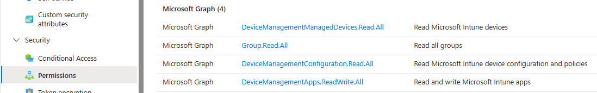

## Add Required Modules

Now we need to add the required Modules to the Automation Account

* On the Automation Account, navigate to the *Shared Resources* section and select *Modules*
* Select *Add a module*

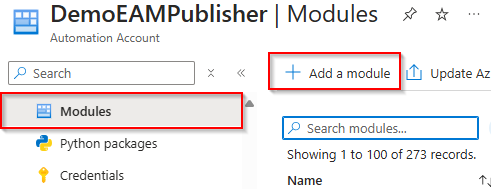

* Select *Browse from gallery*
* Select *Click here to browser from gallery*

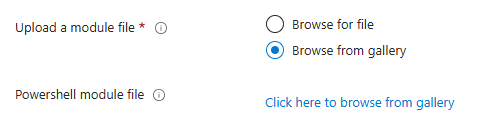

* Search for *Microsoft.Graph.Authentication*
* Select the Module

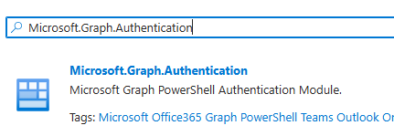

* Select *PowerShell 7.2* as the runtime version
* Select Import

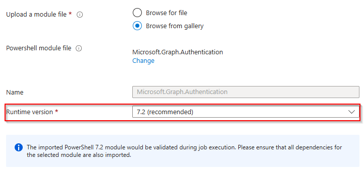

> Wait for the import to complete, as the following modules will be dependent on the Authentication Module!

Now repeat the steps for the following Modules: 
* Microsoft.Graph.Beta.DeviceManagement.Actions
* Microsoft.Graph.Beta.Devices.CorporateManagement
* Microsoft.Graph.Groups
* Microsoft.Graph.Beta.DeviceManagement

Once the import of all Modules has finished, it should look like this: 

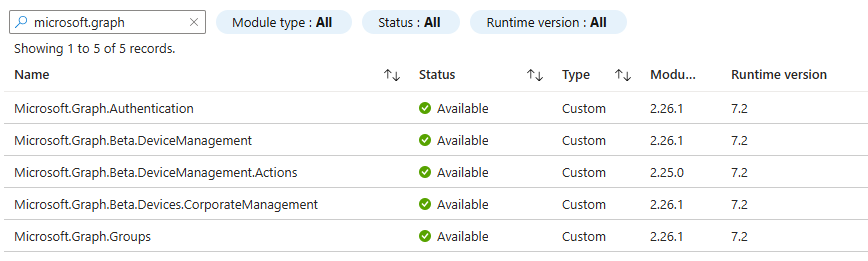

