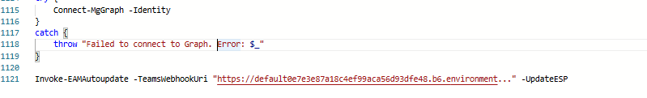
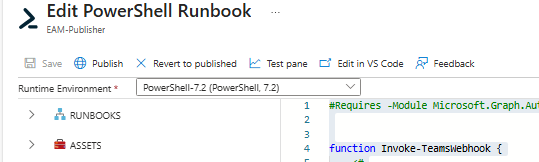

# Setup Azure Automation Runbook

## Prerequisites
* You followed the instructions in chapter 1 and have your Teams Webhook URL ready
* You followed the instructions in chapter 2 and prepared the Azure Automation Account inlcuding: 
    * Assigned the necessary Graph permissions
    * Installed the necessary Modules

## Create Automation Runbook 

* On the Automation Account go to the *Proccess Automation* section and select *Runbooks*
* Select *Create Runbook*

* Configure the following Runbook settings: 
    * Name
    * Runbook type = PowerShell
    * Runbook version = PowerShell 7.2
* Create the Runbook

Now paste the code from the Invoke-EAMAutoUpdate into the runbook. 
Adjust the parameter on the last line according to your needes. Add the Teamswebhook Url which you have created in step1 if you plan on sending Teams notifications. 

Now Publish the Runbook 

> **Note:** To ensure that the runbook is running on a fixed schedule I would recommend creating a schedule that runs at least once a day and publishes new application versions. There should be a minimum time of 1h between runbook executions as the Enterprise Application Management report in Intune requires some time to recognize, that a new application version has been published. More information about schedules can be found here: https://learn.microsoft.com/en-us/azure/automation/shared-resources/schedules