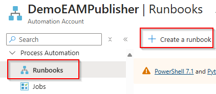
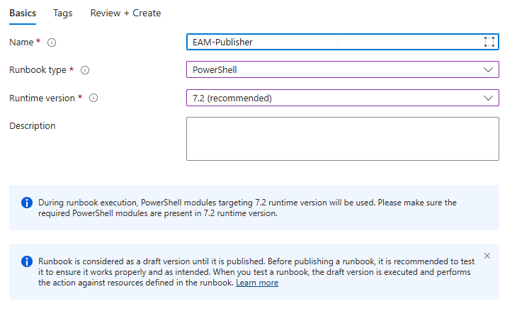

# Setup Azure Automation Runbook

## Prerequisites
* You followed the instructions in chapter 1 and have your Teams Webhook URL ready
* You followed the instructions in chapter 2 and prepared the Azure Automation Account inlcuding: 
    * Assigned the necessary Graph permissions
    * Installed the necessary Modules

## Create Automation Runbook 

* On the Automation Account go to the *Proccess Automation* section and select *Runbooks*
* Select *Create Runbook*

*Configure the following Runbook settings: 
    * Name
    * Runbook type = PowerShell
    * Runbook version = PowerShell 7.2
* Create the Runbook

