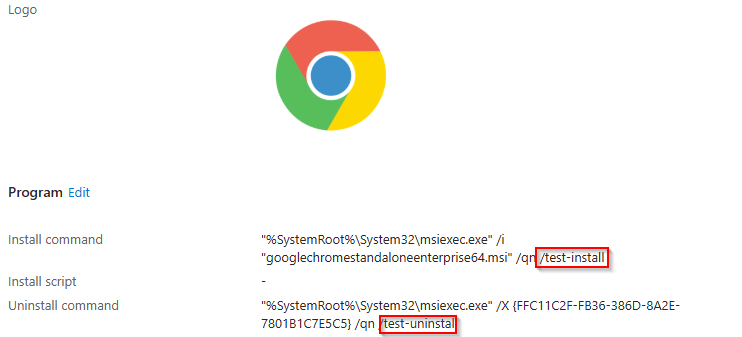

# Configure Custom Command Line Parameters

The Custom Command Line Parameters feature in the EAM-AutoUpdater allows you to append additional install and/or uninstall command line arguments to specific apps when a new version is deployed from the EAM catalog. This is useful when the catalog-provided command line needs extra flags — for example, to suppress restarts, enable silent mode, or pass organisation-specific switches.

When a matching entry is found for the app being updated, the script appends the configured values to the `installCommandLine` and/or `uninstallCommandLine` properties on the newly created Intune app via a Graph API PATCH call. The original catalog-provided command line is preserved; your values are added to the end.



## Append Parameter

In order to use the Custom Command Line Parameters feature, append the `-CommandLineParameters` switch to your `Invoke-EAMAutoupdate` call:

```powershell
Invoke-EAMAutoupdate -TeamsWebhookUri <URI> -UpdateESP -CommandLineParameters
```

## Configure the `$CustomCommandLineParameters` Variable

The `$CustomCommandLineParameters` variable is an array of `PSCustomObject` entries defined before the `Invoke-EAMAutoupdate` call. Each entry targets a specific app by display name.

### Properties

| Property | Required | Description |
|---|---|---|
| `ApplicationName` | Yes | The display name of the EAM catalog app (must match exactly). |
| `AdditionalInstallParameter` | No | The command line argument(s) to append to the app's `installCommandLine`. If `$null` or empty, the install command line is left unchanged. |
| `AdditionalUninstallParameter` | No | The command line argument(s) to append to the app's `uninstallCommandLine`. If `$null` or empty, the uninstall command line is left unchanged. |

> **Note:** At least one of `AdditionalInstallParameter` or `AdditionalUninstallParameter` should contain a value, otherwise the entry has no effect.

### Example

The following example shows detailed entries with comments:

```powershell
$CustomCommandLineParameters = @(
    # Chrome – append /norestart to the install command, leave uninstall unchanged
    [PSCustomObject]@{
        ApplicationName            = 'Chrome for Business 64-bit'
        AdditionalInstallParameter = '/norestart'
        AdditionalUninstallParameter = $null
    }
    # Notepad++ – append /S to both install and uninstall commands
    [PSCustomObject]@{
        ApplicationName            = 'Notepad++'
        AdditionalInstallParameter = '/S'
        AdditionalUninstallParameter = '/S'
    }
    # 7-Zip – only modify the uninstall command
    [PSCustomObject]@{
        ApplicationName            = '7-Zip'
        AdditionalInstallParameter = $null
        AdditionalUninstallParameter = '/quiet'
    }
)
```

Additionally you can also format the object like this:

```powershell
$CustomCommandLineParameters = @(
    [PSCustomObject]@{ApplicationName = 'Chrome for Business 64-bit'; AdditionalInstallParameter = '/norestart'; AdditionalUninstallParameter = $null }
    [PSCustomObject]@{ApplicationName = 'Notepad++'; AdditionalInstallParameter = '/S'; AdditionalUninstallParameter = '/S' }
    [PSCustomObject]@{ApplicationName = '7-Zip'; AdditionalInstallParameter = $null; AdditionalUninstallParameter = '/quiet' }
)
```

## How It Works

When the `-CommandLineParameters` switch is specified and the script deploys a new app version, the following happens:

1. The script looks up the app's `ApplicationName` in the `$CustomCommandLineParameters` array.
2. If no matching entry is found, the app's command lines remain as provided by the catalog.
3. If a match is found:
   - If `AdditionalInstallParameter` has a value, it is appended (with a space) to the catalog's `installCommandLine`.
   - If `AdditionalUninstallParameter` has a value, it is appended (with a space) to the catalog's `uninstallCommandLine`.
   - Properties set to `$null` or empty are skipped — the corresponding command line is left unchanged.
4. A single PATCH request updates the app in Intune with the modified command line(s).

**Example:** The catalog provides the following install command for Chrome:

```
msiexec /i "GoogleChrome.msi" /qn
```

With `AdditionalInstallParameter = '/norestart'`, the resulting command line becomes:

```
msiexec /i "GoogleChrome.msi" /qn /norestart
```

> **Important:** The values you specify are appended as-is. Make sure the resulting command line is valid for the application's installer. The script does not validate whether the combined command line is syntactically correct. I highly recommend that you test the command lines in a Windows Sandbox and verify if they actually work. If you add new command line parameters they will only be appended with the release of the next new application version!

> **Note:** The command line parameters are applied after the app is created and the supersedence relationship is configured, but before assignments are migrated.
