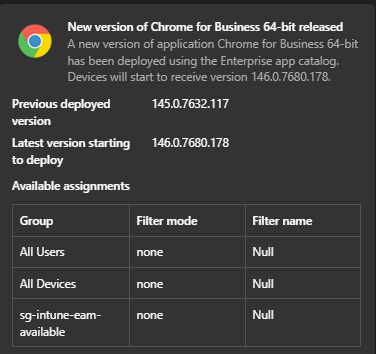

# EAM-AutoUpdater

The EAM-AutoUpdater is a PowerShell-based automation tool for Microsoft Intune Enterprise Application Management (EAM). It monitors the EAM catalog for available app updates, automatically deploys new versions, and migrates assignments, metadata, and configuration from the previous version — keeping your Intune environment up to date with minimal manual effort.

The script is designed to run as an Azure Automation runbook using a managed identity, but can also be executed interactively for testing.

## Features

- **Automatic update detection**: Queries the Intune EAM catalog report for apps with available updates.
- **Automatic deployment**: Creates the new app version in Intune directly from the catalog package.
- **Supersedence management**: Configures the new version to supersede the current version and retains only the latest two versions (N and N-1). Any older versions are unlinked and deleted automatically.
- **Assignment migration**: Re-creates all assignments from the previous version on the new app, including:
  - Include and exclude group modes
  - All Users / All Devices targets
  - Assignment filter settings (include/exclude mode and filter ID)
  - Delivery optimization priority
  - Notification settings
  - Auto-update settings for available intent assignments
- **Metadata migration**: Copies the following properties from the previous app to the new app:
  - Scope tags (role scope tag IDs)
  - Company Portal featured state
  - Owner and notes
  - App categories
  - App icon / logo
- **Enrollment Status Page (ESP) updates**: Optionally replaces the previous app with the new version in any Windows Enrollment Status Page configuration that tracks it.
- **App exclusions** — Allows specific apps to be skipped by display name.
- **Teams notifications**: Sends an adaptive card to a Teams channel (via Power Automate webhook) summarizing the deployment, migrated assignments, and ESP updates.



## Prerequisites

### PowerShell Modules

The following Microsoft Graph PowerShell SDK modules are required:

| Module | Purpose |
|---|---|
| `Microsoft.Graph.Authentication` | Authentication and `Invoke-MgGraphRequest` |
| `Microsoft.Graph.Beta.DeviceManagement.Actions` | EAM catalog report retrieval |
| `Microsoft.Graph.Beta.Devices.CorporateManagement` | Mobile app CRUD, assignments, and relationships |
| `Microsoft.Graph.Groups` | Resolving Entra ID group display names for assignment migration |
| `Microsoft.Graph.Beta.DeviceManagement` | Assignment filters and Enrollment Status Page configurations |

### Microsoft Graph API Permissions

The managed identity (or app registration) used to run the script requires the following **application** permissions:

| Permission | Purpose |
|---|---|
| `DeviceManagementManagedDevices.Read.All` | Required to read the Win32CatalogAppsUpdate Report |
| `DeviceManagementConfiguration.Read.All` | Required to read Filter information related to the assignments" |
| `DeviceManagementApps.ReadWrite.All` | Read and write mobile apps, assignments, relationships, categories, and the EAM update report |
| `Group.Read.All` | Read Entra ID group properties for assignment migration |
| `DeviceManagementServiceConfig.ReadWrite.All` | Read and write Enrollment Status Page configurations and assignment filters > **Note:** Some Graph API calls target the **beta** endpoint. |

> **Note:** The `DeviceManagementServiceConfig.ReadWrite.All` permission is only required if you intend to update the application in the ESP. If you don't want to update your ESP profile make sure to remove the permission scope from the below snippet. 

## Parameters

| Parameter | Type | Required | Default | Description |
|---|---|---|---|---|
| `TeamsWebhookUri` | `string` | No | *(empty)* | The Power Automate or Teams webhook URL for posting deployment notifications. When omitted, no Teams notification is sent. |
| `UpdateESP` | `switch` | No | `$false` | When specified, the script replaces the previous app with the new version in any Enrollment Status Page that tracks it. |
| `ExcludeApps` | `string[]` | No | `@()` | An array of application display names to skip during processing. Apps whose name matches an entry in this list will not be updated. |

## Usage Examples

### Basic — Deploy all available updates

```powershell
Invoke-EAMAutoupdate 
```

Deploys all available EAM catalog updates, migrates assignments and metadata, and cleans up older superseded versions. No Teams notification is sent.

### With Teams notification

```powershell
Invoke-EAMAutoupdate -TeamsWebhookUri "https://prod-XX.westeurope.logic.azure.com:443/workflows/..."
```

Same as above, but sends an adaptive card to the configured Teams channel for each deployed app.

### With Enrollment Status Page updates

```powershell
Invoke-EAMAutoUpdate -UpdateESP
```

Deploys updates and replaces the previous app version with the new version in any Enrollment Status Page that references it.

### Exclude specific apps

```powershell
Invoke-EAMAutoUpdate -ExcludeApps "draw.io Desktop"
```

Deploys all available updates except for **draw.io Desktop**, which is skipped.

### Exclude multiple apps

```powershell
Invoke-EAMAutoUpdate-V2.ps1 -ExcludeApps "draw.io Desktop", "Notepad++"
```

### Combining all parameters

```powershell
Invoke-EAMAutoUpdate `
    -TeamsWebhookUri "https://prod-XX.westeurope.logic.azure.com:443/workflows/..." `
    -UpdateESP `
    -ExcludeApps "draw.io Desktop"
```

Deploys all available updates (except draw.io Desktop), updates any matching Enrollment Status Pages, and sends a Teams notification for each deployment.

### Running in Azure Automation

When running as an Azure Automation runbook, authentication uses the managed identity automatically:

```powershell
Connect-MgGraph -Identity
```

The script calls `Connect-MgGraph -Identity` at startup. Ensure the Automation Account's managed identity has the required Graph permissions listed above.

## Set up guide
Follow the following setup guide for more detailed instructions: 
* [Setup Teams Webhook](./Documentation/01-Setup-TeamsWebhook.md)
* [Setup Azure Automation Account](./Documentation/02-Setup-AzureAutomationAccount.md)
* [Setup Azure Automation Runbook](./Documentation/03-Setup-AzureAutomation-Runbook.md)

## Public Preview Notice

The EAM-AutoUpdater is currently in public preview. Your feedback is very much appreciated.

## FAQ

### How can I add new assignments to an existing application?
You can add a new assignment by editing the assignments on the latest application version that you have or the EAM AutoUpdater has deployed. The script will then migrate your assignments over to any new application version that is being deployed.

### How does the EAM-AutoUpdater handle previous versions?
The EAM-AutoUpdater always leaves N-1 in your environment. 
An example, 
* You publish Application version 1.0 from the Enterprise App Catalog. 
* Microsoft releases version 1.1, the EAM AutoUpdater will create the version 1.1 for you and supersede version 1.0.
* Microsfot releases version 1.2, the EAM AutoUpdater will, supersede version 1.1 with version 1.2. Remove the supersedence between version 1.1 and 1.0 and delete the app with version 1.0.

## Disclaimer

This script is provided "as is" without any warranties, express or implied, including but not limited to implied warranties of merchantability, fitness for a particular purpose, or non-infringement. You assume all risks associated with the quality and performance of the script.

The authors or copyright holders shall not be liable for any claims, damages, or other liabilities, whether in contract, tort, or otherwise, arising from or in connection with the script or its use.

Always understand the contents and effects of any script from the Internet before running it. It is highly recommended to thoroughly test the script in a safe environment before using it in production.


