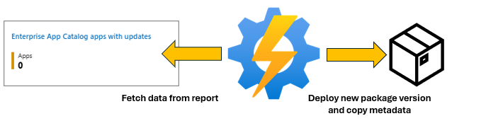
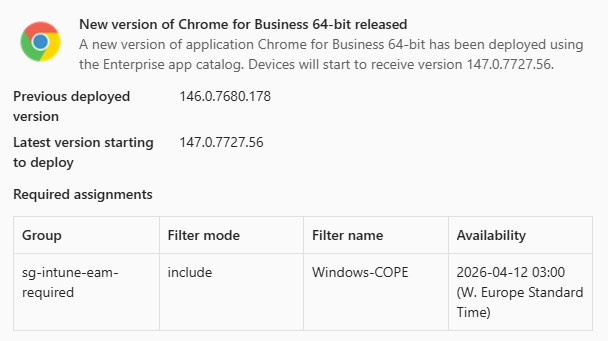

# EAM-AutoUpdater

The EAM-AutoUpdater is a PowerShell-based automation tool for Microsoft Intune Enterprise Application Management (EAM). It monitors the EAM catalog for available app updates, automatically deploys new versions, and migrates assignments, metadata, and configuration from the previous version — keeping your Intune environment up to date with minimal manual effort.



The script is designed to run as an Azure Automation runbook using a managed identity, but can also be executed interactively for testing.

> **Note:** In order to use this solution you must have Microsoft Intune Enterprise Application Management available in your tenant. Currently this capability requires and Enterprise Application Management standalone license or an Intune Suite license. In Summer 2026 this feature will be added to M365 E5 licenses.

## Features

- **Automatic update detection**: Queries the Intune EAM catalog report for apps with available updates.
- **Automatic deployment**: Creates the new app version in Intune directly from the catalog package.
- **Supersedence management**: Configures the new version to supersede the current version and retains only the latest two versions (N and N-1). Any older versions are unlinked and deleted automatically.
- **Assignment migration**: Re-creates all assignments from the previous version on the new app, including:
  - Include and exclude group modes
  - All Users / All Devices targets
  - Assignment filter settings (include/exclude mode and filter ID)
  - Delivery optimization priority
  - Notification settings
  - Auto-update settings for available intent assignments, since the previous package version will remain in the tenant and the assignments are left intact, the auto update setting will also automatically push the update, without any user interaction required. 
- **Metadata migration**: Copies the following properties from the previous app to the new app:
  - Scope tags (role scope tag IDs)
  - Company Portal featured state
  - Owner and notes
  - App categories
  - App icon / logo
- **Enrollment Status Page (ESP) updates**: Optionally replaces the previous app with the new version in any Windows Enrollment Status Page configuration that tracks it.
- **App exclusions** Allows specific apps to be skipped by display name.
- **Update Rings** Configure Update Rings and delay the deplyoment of new application versions to specific applications by using the Win32 App availability setting. 
- **Custom command line parameters**: Append additional install and/or uninstall command line parameters to specific apps. Define entries in the `$CustomCommandLineParameters` array, and the script will append the specified values to the catalog-provided `installCommandLine` and `uninstallCommandLine` when deploying the new version.
- **Teams notifications**: Sends an adaptive card to a Teams channel (via Power Automate webhook) summarizing the deployment, migrated assignments, and ESP updates.



## Prerequisites

### PowerShell Modules

The following Microsoft Graph PowerShell SDK modules are required:

| Module | Purpose |
|---|---|
| `Microsoft.Graph.Authentication` | Authentication and `Invoke-MgGraphRequest` |
| `Microsoft.Graph.Beta.DeviceManagement.Actions` | EAM catalog report retrieval |
| `Microsoft.Graph.Beta.Devices.CorporateManagement` | Mobile app CRUD, assignments, and relationships |
| `Microsoft.Graph.Groups` | Resolving Entra ID group display names for assignment migration |
| `Microsoft.Graph.Beta.DeviceManagement` | Assignment filters and Enrollment Status Page configurations |

### Microsoft Graph API Permissions

The managed identity (or app registration) used to run the script requires the following **application** permissions:

| Permission | Purpose |
|---|---|
| `DeviceManagementManagedDevices.Read.All` | Required to read the Win32CatalogAppsUpdate Report |
| `DeviceManagementConfiguration.Read.All` | Required to read Filter information related to the assignments" |
| `DeviceManagementApps.ReadWrite.All` | Read and write mobile apps, assignments, relationships, categories, and the EAM update report |
| `Group.Read.All` | Read Entra ID group properties for assignment migration |
| `DeviceManagementServiceConfig.ReadWrite.All` | Read and write Enrollment Status Page configurations and assignment filters > **Note:** Some Graph API calls target the **beta** endpoint. |
| `DeviceManagementRBAC.Read.All` | Required to read Scope Tag information associated with Catalog Apps |

> **Note:** The `DeviceManagementServiceConfig.ReadWrite.All` permission is only required if you intend to update the application in the ESP. If you don't want to update your ESP profile make sure to remove the permission scope from the below snippet. 

## Parameters

| Parameter | Type | Required | Default | Description |
|---|---|---|---|---|
| `TeamsWebhookUri` | `string` | No | *(empty)* | The Power Automate or Teams webhook URL for posting deployment notifications. When omitted, no Teams notification is sent. |
| `UpdateESP` | `switch` | No | `$false` | When specified, the script replaces the previous app with the new version in any Enrollment Status Page that tracks it. |
| `ExcludeApps` | `string[]` | No | `@()` | An array of application display names to skip during processing. Apps whose name matches an entry in this list will not be updated. |
| `UpdateRings` | `switch` | No | `$false` | When specified the script will check if you have any Update ring settings configured in your code. For more information about how to setup your update rings, consult the [configure Update Ring documentation](./Documentation/04-Configure-UpdateRings.md) |
| `CommandLineParameters` | `switch` | No | `$false` | When specified, the script checks the `$CustomCommandLineParameters` array for entries matching each app being updated. If a match is found, the `AdditionalInstallParameter` and/or `AdditionalUninstallParameter` values are appended to the app's `installCommandLine` and `uninstallCommandLine` respectively. For more information about how to setup your update rings, consult the [configure Update Ring documentation](./Documentation/05-Configure-CustomCommandLineParameters.md) |

## Usage Examples

### Basic — Deploy all available updates

```powershell
Invoke-EAMAutoupdate 
```

Deploys all available EAM catalog updates, migrates assignments and metadata, and cleans up older superseded versions. No Teams notification is sent.

### With Teams notification

```powershell
Invoke-EAMAutoupdate -TeamsWebhookUri "https://prod-XX.westeurope.logic.azure.com:443/workflows/..."
```

Same as above, but sends an adaptive card to the configured Teams channel for each deployed app.

### With Enrollment Status Page updates

```powershell
Invoke-EAMAutoUpdate -UpdateESP
```

Deploys updates and replaces the previous app version with the new version in any Enrollment Status Page that references it.

### Exclude specific apps

```powershell
Invoke-EAMAutoUpdate -ExcludeApps "draw.io Desktop"
```

Deploys all available updates except for **draw.io Desktop**, which is skipped.

### Exclude multiple apps

```powershell
Invoke-EAMAutoUpdate -ExcludeApps "draw.io Desktop", "Notepad++"
```

### Define Update Rings

For more information about how to setup your update rings, consult the [configure Update Ring documentation](./Documentation/04-Configure-UpdateRings.md)

```powershell
$UpdateRingSettings = @(
    [PSCustomObject]@{ApplicationName = 'Chrome for Business 64-bit'; Assignmenttype = 'available'; groupId = '223f4e5b-61a6-47cc-a13c-e2649bc3ad31'; DaysinDelay = '3'; AvailabilityTimeHour = 9; TimeZoneId = 'W. Europe Standard Time' }
    [PSCustomObject]@{ApplicationName = 'Chrome for Business 64-bit'; Assignmenttype = 'available'; groupId = 'adadadad-808e-44e2-905a-0b7873a8a531'; DaysinDelay = '7' }
)
Invoke-EAMAutoUpdate -UpdateRings
```

### Custom command line parameters

For more information about how to setup your update rings, consult the [configure Update Ring documentation](./Documentation/05-Configure-CustomCommandLineParameters.md)

```powershell
$CustomCommandLineParameters = @(
    [PSCustomObject]@{ApplicationName = 'Chrome for Business 64-bit'; AdditionalInstallParameter = '/norestart'; AdditionalUninstallParameter = $null }
    [PSCustomObject]@{ApplicationName = 'Notepad++'; AdditionalInstallParameter = '/S'; AdditionalUninstallParameter = '/S' }
)

Invoke-EAMAutoUpdate -CommandLineParameters
```

Appends `/norestart` to Chrome's install command line (leaving uninstall unchanged), and appends `/S` to both the install and uninstall command lines for Notepad++. Only the properties with a non-null value are appended; the other is left as the catalog default.

### Combining all parameters

```powershell
Invoke-EAMAutoUpdate `
    -TeamsWebhookUri "https://prod-XX.westeurope.logic.azure.com:443/workflows/..." `
    -UpdateESP `
    -ExcludeApps "draw.io Desktop" `
    -UpdateRings `
    -CommandLineParameters
```

Deploys all available updates (except draw.io Desktop), appends any custom command line parameters, updates any matching Enrollment Status Pages, and sends a Teams notification for each deployment.

### Running in Azure Automation

When running as an Azure Automation runbook, authentication uses the managed identity automatically:

```powershell
Connect-MgGraph -Identity
```

The script calls `Connect-MgGraph -Identity` at startup. Ensure the Automation Account's managed identity has the required Graph permissions listed above.

## Set up guide
Follow the following setup guide for more detailed instructions: 
* [Setup Teams Webhook](./Documentation/01-Setup-TeamsWebhook.md)
* [Setup Azure Automation Account](./Documentation/02-Setup-AzureAutomationAccount.md)
* [Setup Azure Automation Runbook](./Documentation/03-Setup-AzureAutomation-Runbook.md)
* [Configure Update Rings](./Documentation/04-Configure-UpdateRings.md)
* [Configure Custom Command Line Parameters](./Documentation/05-Configure-CustomCommandLineParameters.md)

## FAQ

> **Note:** For questions regarding Microsoft Intune Enterprise Application Management, refer to [Microsoft's FAQ](https://learn.microsoft.com/en-us/intune/intune-service/apps/apps-enterprise-app-management#frequently-asked-questions-faq)

### How can I add new assignments to an existing application?
You can add a new assignment by editing the assignments on the latest application version that you have or the EAM AutoUpdater has deployed. The script will then migrate your assignments over to any new application version that is being deployed.

### How does the EAM-AutoUpdater handle previous versions?
The EAM-AutoUpdater always leaves N-1 in your environment. 
An example, 
* You publish Application version 1.0 from the Enterprise App Catalog. 
* Microsoft releases version 1.1, the EAM AutoUpdater will create the version 1.1 for you and supersede version 1.0.
* Microsfot releases version 1.2, the EAM AutoUpdater will, supersede version 1.1 with version 1.2. Remove the supersedence between version 1.1 and 1.0 and delete the app with version 1.0.

### How can I get the application logos to show up?
Intune Enterprise Application Management does not automatically add the Applications logos to the app. Instead you have to manually add them to the respective package. You have to add the Logo to the latest version available, once done the EAM-AutoUpdater will migrate the Logo to any newer version available. 

### Does the solution rely on Winget to fetch new application versions?
The EAM-AutoUpdater does not create new software versions or software packages, this solution simply relies on Microsoft's Microsoft Intune Enterprise App catalog and the versions which are released to the catalog by Microsoft. More information can be found [here](https://learn.microsoft.com/en-us/intune/intune-service/apps/apps-enterprise-app-management#does-enterprise-app-management-use-winget)

### What happens if a group used in an assignment has been deleted?
The script detects that the group no longer exists in Entra ID and skips the assignment with a warning. All other assignments are migrated normally — the deleted group's assignment is simply not carried over to the new app version.

### What happens if a scope tag has been deleted?
If a scope tag that was assigned to the previous app version no longer exists, the script skips that tag and migrates only the scope tags that are still valid. A warning is written to the output for each skipped tag.

### Can I use Update Rings with available assignments?
Yes, but with a limitation. Intune does not support `useLocalTime` for available intent assignments, so the script always converts the scheduled time to UTC for available assignments. For required assignments, the script can send local time directly. See the [Update Rings documentation](./Documentation/04-Configure-UpdateRings.md) for details.

### What permissions are needed if I don't use the ESP update feature?
You can remove the `DeviceManagementServiceConfig.ReadWrite.All` permission if you do not pass the `-UpdateESP` switch. All other permissions listed in the prerequisites are still required.

### How often should I run the script?
That depends on your organization's patching cadence. Running the script daily (e.g. via an Azure Automation schedule) ensures new catalog versions are picked up quickly. Combined with Update Rings you can delay rollout to production groups while still deploying to a pilot group on the same day.

### Can I run the script manually for testing?
Yes. You can run `Invoke-EAMAutoupdate` interactively in a PowerShell session. Authenticate first with `Connect-MgGraph -Scopes <required scopes>` instead of `-Identity`, then call the function with your desired parameters.

### Why does the Teams notification show a different time than the Intune portal?
For available assignments with a `TimeZoneId` configured, the Teams card shows the intended local time (e.g. `09:00 (W. Europe Standard Time)`) while Intune displays the UTC equivalent (e.g. `07:00 UTC`). This is because Intune does not support local time for available assignments. The actual availability on devices is the same — only the display differs.

### What happens if no apps have available updates?
The script outputs "No apps with available updates found." and exits without making any changes. No Teams notification is sent.

### Does the script update all apps at once or one at a time?
The script processes apps sequentially, one at a time. Each app goes through the full cycle (deploy, supersede, migrate assignments, clean up old versions, update ESP, copy metadata, send notification) before moving on to the next.

### Can I use this script with Conditional Access or MFA?
When running in Azure Automation with a managed identity, Conditional Access and MFA do not apply — the managed identity authenticates directly. For interactive testing, `Connect-MgGraph` will prompt for MFA if your Conditional Access policies require it.

### What happens if the script fails halfway through processing an app?
The script uses terminating errors. If a critical step fails (e.g. creating the new app, setting supersedence, or creating an assignment), the script stops and throws an error. The new app version may already be created in Intune at that point, so you should check your Intune portal and clean up any partially migrated apps manually.

### Do custom command line parameters replace the original command line?
No. The values specified in `AdditionalInstallParameter` and `AdditionalUninstallParameter` are **appended** to the end of the catalog-provided command line, separated by a space. The original command line is never overwritten.

### What happens if I only specify an install parameter but not an uninstall parameter?
Only the property with a value is appended. If `AdditionalUninstallParameter` is `$null` or empty, the uninstall command line remains exactly as the catalog provides it. The same applies in reverse — you can modify only the uninstall command line without touching the install command line.

### Do I need to include the `$CustomCommandLineParameters` variable for every app?
No. You only need entries for apps where you want to modify the command line. Apps that do not have a matching entry in `$CustomCommandLineParameters` are deployed with the catalog's default command lines.

### Does the script validate my custom command line parameters?
No. The values are appended as-is without any validation. Make sure the resulting combined command line is valid for the application's installer or uninstaller. An invalid command line could cause app installations or removals to fail on devices.

### Can I target the same app in multiple Update Ring entries?
Yes. Each Update Ring entry targets a specific combination of `ApplicationName`, `Assignmenttype`, and `groupId`. You can have multiple entries for the same app as long as the group or assignment type differs — this is the intended way to create a staged rollout (e.g. pilot group after 3 days, production after 7 days).

### Does the script handle apps that are assigned to both users and devices?
Yes. The script re-creates all assignment types from the previous version, including All Users, All Devices, specific group targets, and exclusion groups. Each assignment is migrated independently regardless of target type.

### Will the script overwrite changes I made to the new app version?
The script creates a brand-new app from the catalog and copies metadata from the previous version. If you manually modify the new app after the script creates it, those changes are preserved — the script does not run against apps it has already deployed. On the next catalog update, the script reads the current (new) app's assignments and metadata to migrate them forward again.

### Can I exclude an app temporarily and include it again later?
Yes. Simply add the app's display name to the `-ExcludeApps` parameter when you want to skip it, and remove it when you are ready to resume automatic updates. The script only checks the exclusion list at runtime.

### Are detection rules and requirement rules migrated?
No. Detection rules and requirement rules are part of the app package definition that comes from the EAM catalog. The script creates the new app directly from the catalog package, which includes all rules defined by Microsoft. Custom detection or requirement rules are not supported on EAM catalog apps.

### Does the script support Linux or macOS apps?
No. The EAM catalog currently only contains Win32 apps. The script is designed for `win32CatalogApp` types and the related Graph API endpoints.

### What happens if two catalog updates are released between script runs?
The EAM catalog report always returns the latest available version. The script deploys that version and supersedes whatever version is currently deployed. If you missed an intermediate version, it is simply skipped — the supersedence chain goes directly from your current version to the latest.

## Disclaimer

This script is provided "as is" without any warranties, express or implied, including but not limited to implied warranties of merchantability, fitness for a particular purpose, or non-infringement. You assume all risks associated with the quality and performance of the script.

The authors or copyright holders shall not be liable for any claims, damages, or other liabilities, whether in contract, tort, or otherwise, arising from or in connection with the script or its use.

Always understand the contents and effects of any script from the Internet before running it. It is highly recommended to thoroughly test the script in a safe environment before using it in production.


